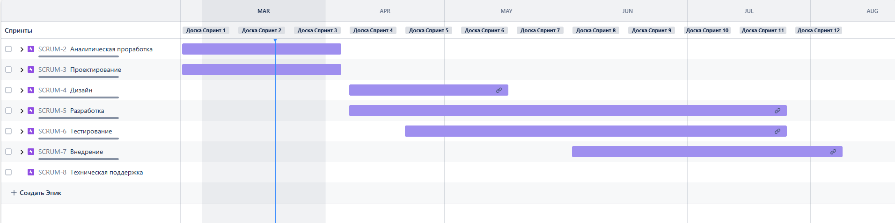
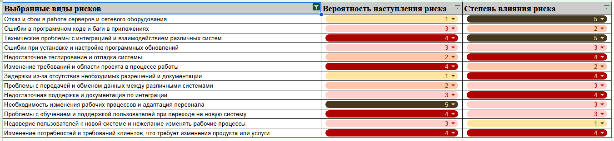
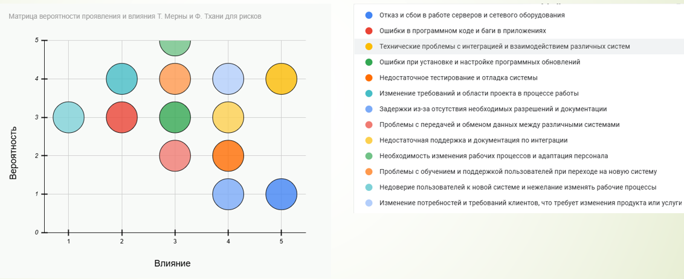
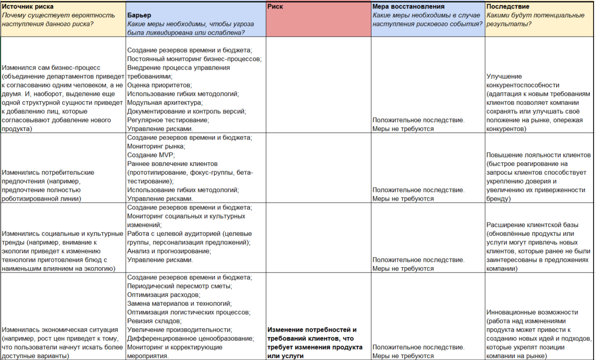
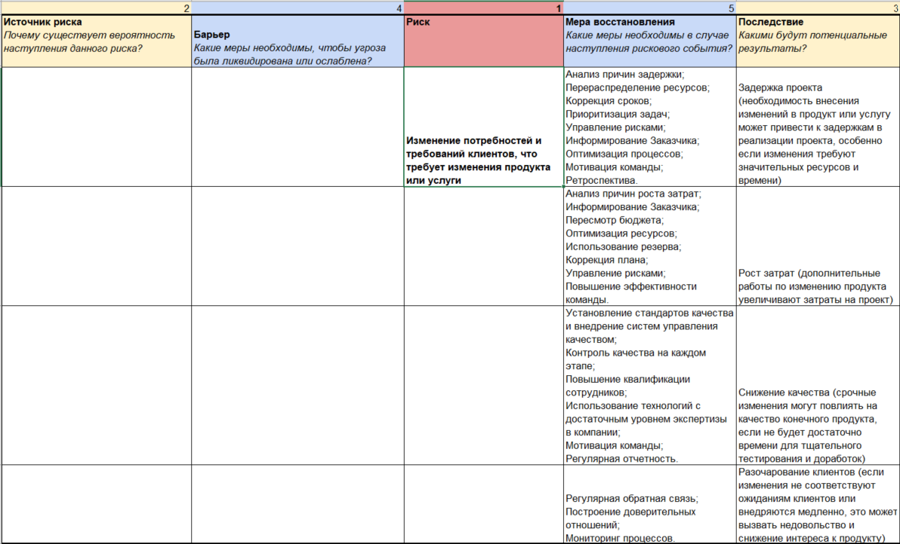
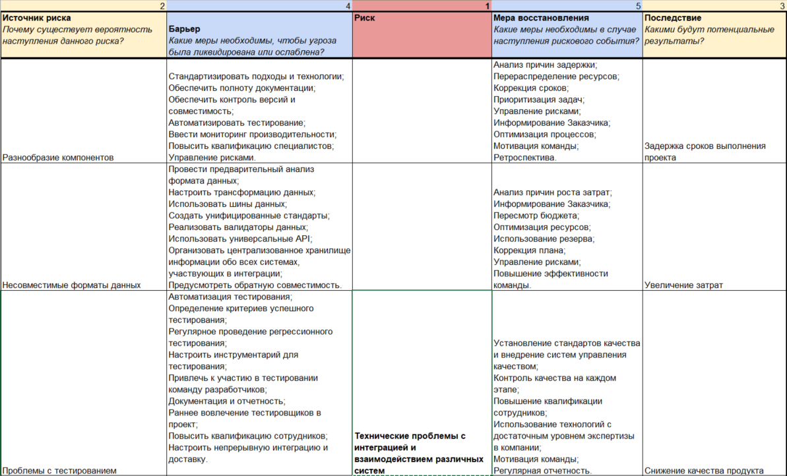
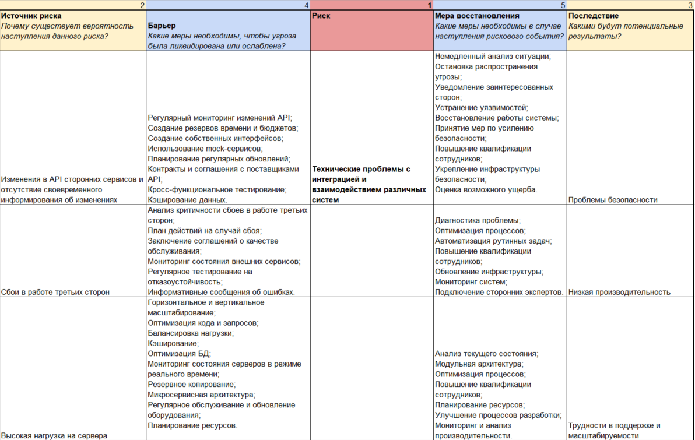
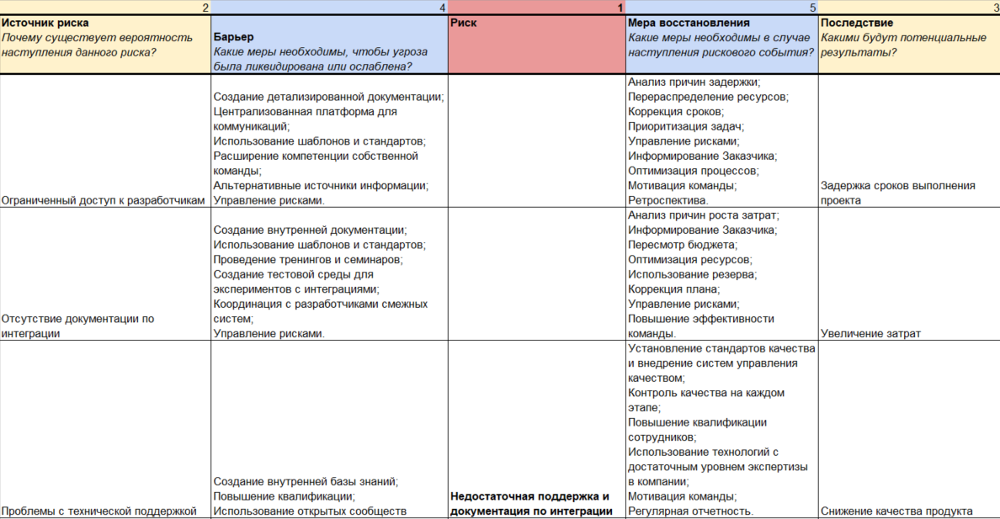
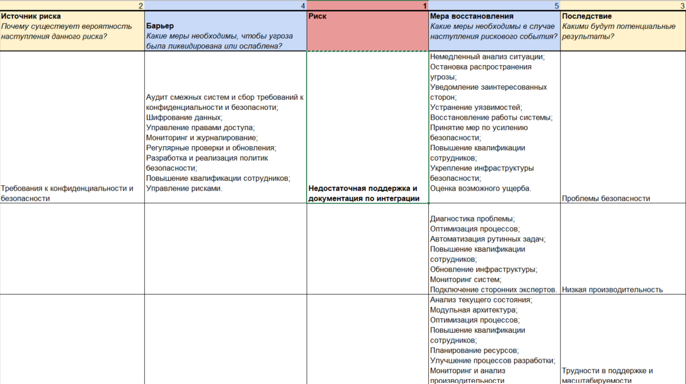
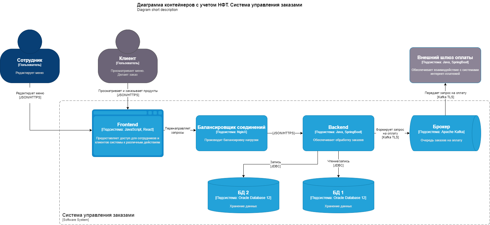

# Проект по разработке системы внедрения новых продуктов в сети закусочных "Замысловатость"

## Общая информация

Проект по разработке сервиса автоматизированного сбора требований для внедрения в продажу новых продуктов
в межгалактических закусочных "Замысловатость"

## Цели внедрения проекта

Цель проекта - быстрое внедрение новых продуктов в сети закусочных.

## Описание проекта

* Ключевой подход - оптимизация процессов по agile.
* Выбранная методология - Scrum. Данная методология выбрана потому, что за счет коротких итераций позволяет быстро вносить
изменения при обнаружении проблем. Церемонии, которые будут использоваться - планирование спринта (1 раз в две недели),
ежедневные короткие встречи с командой, ретро по результатам спринта (1 раз в 2 недели),
уточнение бэклога (по мере необходимости), демо по готовности спринта.
* Создан проект в [Jira](https://monstarnn.atlassian.net/jira/software/projects/SCRUM/boards/1/backlog)

## Roadmap проекта

IMG Roadmap проекта

## Команда проекта

| Должность | Количество |
|-----------|------------|
| Руководитель проекта | 1 |
| Дизайнер | 1 |
| Team Lead системных аналитиков | 1 |
| Системный аналитик | 2 |
| BE Разработчик | 1 |
| FE Разработчик | 2 |
| Тестировщик | 1 |

## Риски проекта

## Анализ рисков

## Описание выбранного решения

По результатам анализа приняты следующие решения:
* Настройка конфигурации веб-сервера
* Горизонтальное масштабирование 
* Добавление балансировщика нагрузки

## Описание архитектуры с НФТ

В связи с решением о применении в организации рекомендаций IAF при описании безопасности архитектуры было принято
решение реализовать применение НФТ в сервисе с наиболее чувствительными данными - сервисе "Система управления заказами".

| Требование  | Атрибут |
|-------------|------------|
| Доступность | 24/7 |
| Минимальное время простоя | 5 минут |
| Быстрый доступ к системе | загрузка меню не более 15 секунд |
| Быстродействие | 120 мс |
| Отзывчивость системы | индикатор прогресса при выполнении длительных операций |
| Минимальное время ответа на запрос | 20 секунд |
| Количество ошибок | 0.01% |
| Время восстановления после отказа системы | 25 минут |
| Защита от сбоев | механизмы автоматического восстановления |
| Добавление новых точек входа для создания заказов | веб-приложение, мобильное приложение, терминалы самообслуживания |
| Горизонтальное масштабирование (увеличение мощности при увеличении количества заказов) | балансировка нагрузки, резерв серверов для автоматического масштабирования в пики |
| Противостояние несанкционированному доступу | двухфакторная аутентификация |
| Целостность данных | шифрование |

## Заключение

Реализация этого проекта позволит увеличить продажи, экономить затраты, привлечь новых клиентов,
повысить конкурентноспособность, расширить рынок сбыта и укрепить бренд в целом.
Инвестиции в проект составит 50 млн рублей. Годовая экономия от внедрения - 15 млн рублей,
выручка от дополнительной продажи и привлечения новых клиентов - 20 млн рублей.
Итого 35 млн рублей общая выручка за первый год, столько же будет за второй год. Выручка за два года - 70 млн руб.
Чистая прибыль за два года 20 млн рублей. Таким образом, несмотря на убыток в первый год,
проект полностью окупается и приносит прибыль во второй год эксплуатации.

